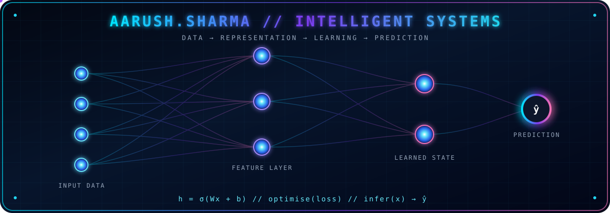

<div align="center">



<br>

[](https://git.io/typing-svg)

# Aarush Sharma

### `Computer Science with Artificial Intelligence`

Building practical systems across **machine learning**, **full-stack development**,  
**computer networking**, **databases** and **low-level programming**.

<br>

[](https://www.linkedin.com/in/aarush-sharma-840a8b2b5)
[](mailto:sharmaaarush79@gmail.com)
[](https://github.com/aarudv)
[](https://github.com/aarudv)

</div>

---

## `SYSTEM_PROFILE.json`

```json
{
  "name": "Aarush Sharma",
  "degree": "Computer Science with Artificial Intelligence (Hons)",
  "university": "University of Nottingham Malaysia",
  "interests": [
    "Machine Learning",
    "Artificial Intelligence",
    "Software Engineering",
    "Full-Stack Development",
    "Computer Networking",
    "Databases and Algorithms"
  ],
  "objective": "Build software that transforms data and logic into useful systems."
}
```

---

## Neural Pipeline

```text
┌─────────────┐     ┌────────────────┐     ┌────────────────┐     ┌─────────────┐
│  Raw Input  │ ──▶ │  Preprocessing │ ──▶ │ Model / System │ ──▶ │   Output    │
└─────────────┘     └────────────────┘     └────────────────┘     └─────────────┘
       │                     │                       │                      │
       ▼                     ▼                       ▼                      ▼
  Text / Data          Clean / Validate       Learn / Compute       Predict / Act
```

---

## Technology Matrix

<div align="center">

### Languages

[](https://skillicons.dev)

### Machine Learning and Data

[](https://skillicons.dev)

`NumPy` · `pandas` · `Matplotlib` · `Jupyter Notebook` · `SQL`  
`Machine Learning` · `Deep Learning` · `Model Evaluation`

### Development and Systems

[](https://skillicons.dev)

`Full-Stack Development` · `Database Design` · `TCP/IP`  
`Socket Programming` · `Data Structures` · `Algorithms`

</div>

---

## Deployed Projects

<table>
<tr>
<td width="50%" valign="top">

### Internship Result Management System

A full-stack application for managing and assessing university internships.

#### Core systems

- Role-based administrator and assessor interfaces
- Student, assessor and internship record management
- Automated assessment calculations
- Results, statistics and chart-based views
- Authentication, validation and error handling

#### Stack

`PHP` `MySQL` `JavaScript` `HTML` `CSS`

<br>

[](https://github.com/aarudv/Internship-Result-Management-System)

</td>
<td width="50%" valign="top">

### C Socket Programming Suite

A progressive TCP client-server suite developed in C using Winsock.

#### Core systems

- Persistent client-server sessions
- Validation and command processing
- Client IP, port and message logging
- Date and timezone functionality
- Concurrent two-client chat communication

#### Stack

`C` `Winsock` `TCP/IP` `select()` `Threads`

<br>

[](https://github.com/aarudv/C-Socket-Programming-Client-Server-Suite)

</td>
</tr>

<tr>
<td colspan="2" valign="top">

### Cyberbullying and Toxic Text Analyzer

A rule-based text-analysis system implemented using standard C libraries.

#### Processing pipeline

```text
Text File
   │
   ▼
Tokenisation ──▶ Normalisation ──▶ Stopword Filtering
                                           │
                                           ▼
                                Toxic Dictionary Matching
                                           │
                                           ▼
                         Frequency and Toxicity Analysis
                                           │
                                           ▼
                                  Generated Report
```

#### Core systems

- Text tokenisation and normalisation
- Configurable stopword filtering
- Toxic-word dictionary matching
- Word-frequency and toxicity analysis
- Sorting and text-report generation
- Menu-driven command-line interface

#### Stack

`C` `Data Structures` `Algorithms` `File I/O` `Text Processing`

<br>

[](https://github.com/aarudv/Cyberbullying-and-Toxic-Text-Analyzer)

</td>
</tr>
</table>

---

## Verified Learning

### Machine Learning Specialization

Completed the three-course specialization offered by  
**DeepLearning.AI and Stanford Online through Coursera**.

```text
Supervised Learning
├── Linear Regression
├── Logistic Regression
├── Neural Networks
└── Decision Trees and Ensembles

Unsupervised Learning
├── Clustering
└── Anomaly Detection

Advanced Applications
├── Recommender Systems
└── Reinforcement Learning
```

[](https://coursera.org/verify/specialization/W73D4Q39PUK0)

---

## Contribution Network

<picture>
  <source
    media="(prefers-color-scheme: dark)"
    srcset="https://raw.githubusercontent.com/aarudv/aarudv/output/github-snake-dark.svg"
  />
  <source
    media="(prefers-color-scheme: light)"
    srcset="https://raw.githubusercontent.com/aarudv/aarudv/output/github-snake.svg"
  />
  
</picture>

---

<div align="center">

### End of Transmission

```text
while (learning) {
    build();
    test();
    improve();
}
```

[LinkedIn](https://www.linkedin.com/in/aarush-sharma-840a8b2b5)
&nbsp;·&nbsp;
[Email](mailto:sharmaaarush79@gmail.com)
&nbsp;·&nbsp;
[GitHub](https://github.com/aarudv)

</div>
